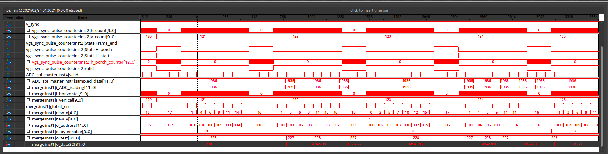

# RTR710_final_part1
 Samples analog VGA signal, counts horizontal and vertical sync pulses. Input 800x600, output 25x20 pixels. Input clk is 40 MHz for each entity. We used HDMI to VGA adapter which tricks pc motherboard into sending video data.
 
 Part1 of final project consists of 3 parts:
 
 **1) ADC controller**
    
SPI master that controlls DE0-Nano on board LTC2308. ADC_CONVST (conversion start or chip enable) should be high for ~1.5 us for ADC to start working, 0.5 us for pushing configuration bits to ADC and recieving 12 bits of sampled data. Each 2 us we get 12 bits of data. Outputs valid = '1' when 12 outputs bits are ready.
    
 **2) VGA sync pulse counter**
    
Goal of this module is to output current location of VGA pixel. VGA sync signals are connected to DE0-nano GPIO pins. Horizontal counter increments on rising edge of 40 MHz clk (same clock is used for 800x600@60 VGA), each horizontal sync pulse increments vertical counter and each vertical sync pulse resets both counters. Module takes into account back porch of both sync signals. Also outputs valid = '1' when we are in visible region of frame.
    
  **3) Merge**
  
Module that merges together 1) and 2). Converts 800x600 horizontal and vertical coordinates to 25x20 (new_x x new_y) and calculates new memory address 25 * new_x + new_y. Converts ADC (11 downto 0) output to (9 downto 2) and writes result into 32bit word - xxxxxxxxRRRRRRRRGGGGGGGGBBBBBBBB (stuffs zeros and shifts left according to byte enable value). Information about each color is collected for 3 horizontal lines at a time, for example lines 0,1 and 2 output new coordinates plus corresponding 8 bits of RED information, lines 3,4 and 5 - new coordinates plus corresponding 8 bits of GREEN information. Module also outputs byte enable signal ("0100" for R, "0010" for G, "0001" for B), address, 32bit word for color and enable signal when 1) and 2) both are valid.

